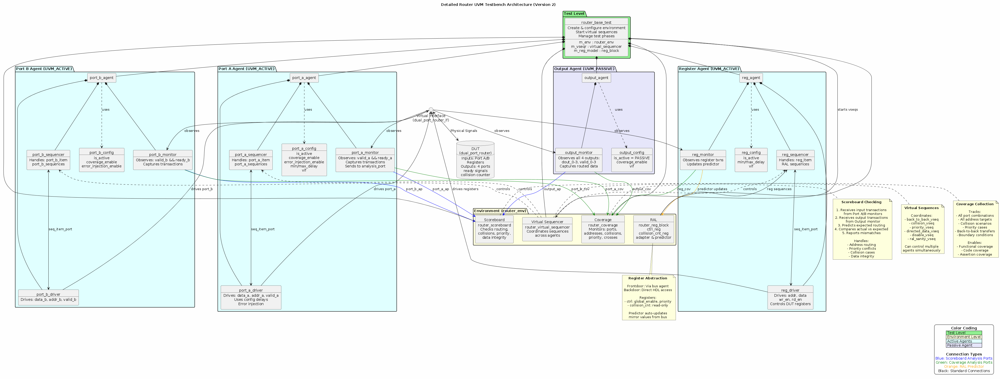
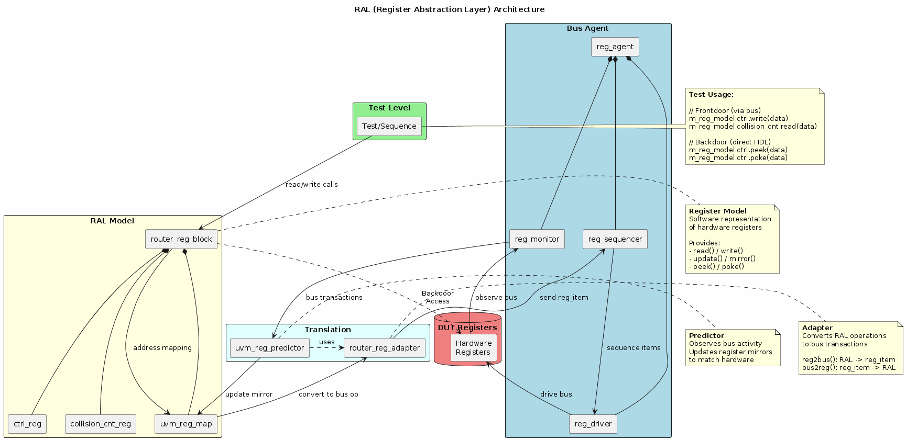
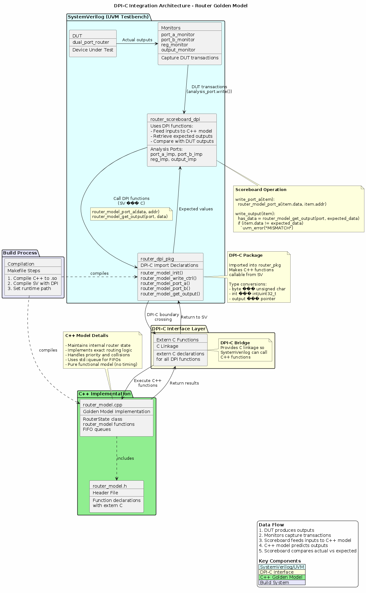
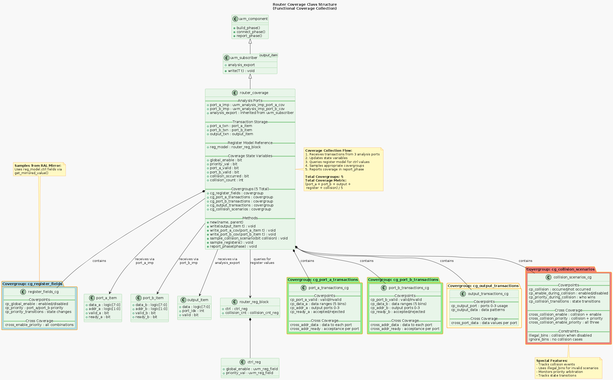
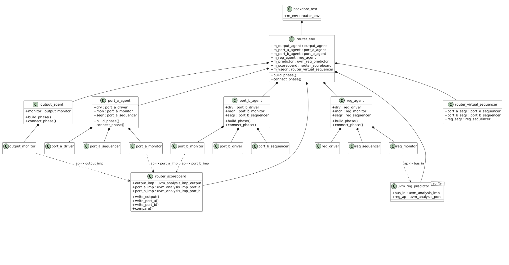
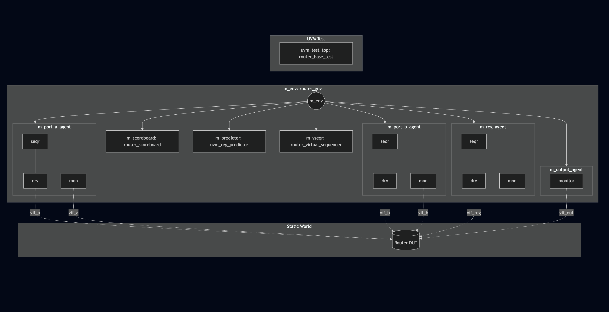

# UVM Testbench: 4-Agent Dual-Port Router
In this repository, I made a UVM environment from scratch for a Dual-Port Router.
The purpose is to create a scalable environment that implements Virtual Sequencers, RAL, Scoreboards, Coverage, and DPI-C. 

To view the on-going current Coverage Report, [CLICK HERE](https://npcarter2025.github.io/Router_UVM/coverage/dashboard.html)

# Testbench Architecture
High Level Overview




^Coverage Diagram is still a WIP (minor errors that I'll fix this week)
<!-- 
 -->


## Key Verification Features

- **4-Agent Architecture**: Includes two active input agents (Port A/B), an active Register/Control agent, and a passive output monitor.

- **Virtual Sequencing**: Implemented a `router_virtual_sequencer` to coordinate complex traffic scenarios, including port collisions and priority arbitration.

- **Register Abstraction Layer (RAL)**: Integrated a full register model supporting Frontdoor/Backdoor access for DUT configuration and status tracking.

- **Scalable Scoreboard**: Utilized `uvm_analysis_imp_decl` to create independent implementation ports
- For simulation, I used Synopsys VCS with a Makefile script.

## Current Roadmap
- [x] Virtual Sequencer & Multi-Agent Connectivity
- [x] RAL Model & Adapter Implementation
- [x] Configuration Objects
- [x] DPI-C Golden Reference Model (branch: `feature/dpi-c`)
- [ ] Functional Coverage (branch: `feature/coverage`)

## Final Integration
I have already made rough drafts for a DPI-C Golden Model, and a Coverage class, which are both on new branches named `feature/dpi-c` and `feature/coverage` 

---


# Current Structure
```
Router_UVM
├── Makefile
├── README.md
├── agent
│   ├── output_agent
│   │   ├── output_agent.svh
│   │   ├── output_config.svh
│   │   ├── output_item.svh
│   │   └── output_monitor.svh
│   ├── port_a_agent
│   │   ├── port_a_agent.svh
│   │   ├── port_a_config.svh
│   │   ├── port_a_driver.svh
│   │   ├── port_a_item.svh
│   │   ├── port_a_monitor.svh
│   │   └── port_a_sequencer.svh
│   ├── port_b_agent
│   │   ├── port_b_agent.svh
│   │   ├── port_b_config.svh
│   │   ├── port_b_driver.svh
│   │   ├── port_b_item.svh
│   │   ├── port_b_monitor.svh
│   │   └── port_b_sequencer.svh
│   └── reg_agent
│       ├── reg_agent.svh
│       ├── reg_config.svh
│       ├── reg_driver.svh
│       ├── reg_item.svh
│       ├── reg_monitor.svh
│       └── reg_sequencer.svh
├── docs
│   ├── diagrams/...
│   └── test_plans/...
├── env
│   ├── router_env.svh
│   ├── router_env_config.svh
│   ├── router_scoreboard.svh
│   └── router_virtual_sequencer.svh
├── ral
│   ├── collision_cnt_reg.svh
│   ├── ctrl_reg.svh
│   ├── router_reg_adapter.svh
│   └── router_reg_block.svh
├── seq
│   ├── back_to_back_vseq.svh
│   ├── backdoor_test_vseq.svh
│   ├── collision_vseq.svh
│   ├── disable_vseq.svh
│   ├── port_a_base_sequence.svh
│   ├── port_b_base_sequence.svh
│   ├── priority_vseq.svh
│   ├── ral_sanity_vseq.svh
│   ├── reg_base_sequence.svh
│   └── router_base_vseq.svh
├── src
│   ├── dual_port_router.sv
│   └── dual_port_router_if.sv
├── tb
│   └── tb_top.sv
└── tests
    ├── back_to_back_test.svh
    ├── backdoor_test.svh
    ├── config_test.svh
    ├── disable_test.svh
    ├── priority_test.svh
    ├── ral_sanity_test.svh
    ├── router_base_test.svh
    └── router_pkg.svh
```


Below are some good debugging patterns that I am trying to memorize.

# UVM Debugging Grep Patterns

Quick reference for filtering UVM simulation logs.

## Grep Flags Reference

| Flag | Meaning | Example |
|------|---------|---------|
| `-E` | Extended regex (allows `\|` for OR) | `grep -E "ERROR\|FATAL"` |
| `-i` | Case insensitive | `grep -i "error"` |
| `-c` | Count matches (don't show lines) | `grep -c "UVM_ERROR"` |
| `-n` | Show line numbers | `grep -n "MISMATCH"` |
| `-B5` | Show 5 lines **B**efore match | `grep -B5 "ERROR"` |
| `-A3` | Show 3 lines **A**fter match | `grep -A3 "ERROR"` |
| `-C2` | Show 2 lines **C**ontext (before+after) | `grep -C2 "ERROR"` |
| `-v` | In**v**ert match (lines NOT matching) | `grep -v "UVM_INFO"` |
| `-l` | List filenames only | `grep -l "ERROR" *.log` |
| `-r` | **R**ecursive search in directories | `grep -r "TODO" src/` |
| `-w` | Match whole **w**ord only | `grep -w "data"` |

## Shell Redirection Reference

| Syntax | Meaning | Example |
|--------|---------|---------|
| `>` | Redirect stdout to file (overwrite) | `./simv > sim.log` |
| `>>` | Redirect stdout to file (append) | `./simv >> sim.log` |
| `2>` | Redirect stderr to file | `./simv 2> errors.log` |
| `2>&1` | Redirect stderr to same place as stdout | `./simv > sim.log 2>&1` |
| `&>` | Redirect both stdout and stderr to file | `./simv &> sim.log` |
| `\|` | Pipe stdout to another command | `./simv \| grep ERROR` |
| `\| tee` | Pipe to screen AND file | `./simv \| tee sim.log` |
| `2>&1 \| tee` | Both streams to screen and file | `./simv 2>&1 \| tee sim.log` |

### Common Patterns

```bash
# Save all output to file (won't see on screen)
./simv > sim.log 2>&1

# See output AND save to file
./simv 2>&1 | tee sim.log

# Separate stdout and stderr
./simv > output.log 2> errors.log

# Discard output entirely
./simv > /dev/null 2>&1
```

## Finding Errors and Warnings

```bash
grep "UVM_ERROR" sim.log                    # All errors
grep "UVM_FATAL" sim.log                    # All fatals
grep "UVM_WARNING" sim.log                  # All warnings
grep -E "UVM_ERROR|UVM_FATAL" sim.log       # Errors and fatals
grep -c "UVM_ERROR" sim.log                 # Count errors
```

## Filter by Message ID

```bash
grep "\[SB\]" sim.log                       # Scoreboard messages
grep "\[PORT_A_DRV\]" sim.log               # Port A driver
grep "\[PORT_B_MON\]" sim.log               # Port B monitor
grep "\[router_scoreboard\]" sim.log        # Scoreboard summary
```

## Filter by Time

```bash
grep "@ 0:" sim.log                         # Events at time 0
grep "@ 145000" sim.log                     # Events at specific time
grep -E "@ [0-9]+00:" sim.log               # Events at round numbers
```

## Transaction Flow

```bash
grep -E "sent|received" sim.log             # Track transactions
grep -E "MATCH|MISMATCH" sim.log            # Scoreboard comparisons
grep "Driving" sim.log                      # Driver activity
grep "Observed" sim.log                     # Monitor activity
```

## Component Hierarchy

```bash
grep "uvm_test_top.m_env" sim.log           # All env messages
grep "m_port_a_agent" sim.log               # Port A agent messages
grep "m_scoreboard" sim.log                 # Scoreboard messages
```

## UVM Phases

```bash
grep "phase" sim.log                        # Phase transitions
grep "raise_objection\|drop_objection" sim.log  # Objections
grep "TEST_DONE" sim.log                    # Test completion
```

## Combine Patterns

```bash
# Errors with context (3 lines before/after)
grep -B3 -A3 "UVM_ERROR" sim.log

# Scoreboard activity in time order
grep -E "\[SB\].*@" sim.log | sort -t@ -k2 -n

# Find mismatches and their context
grep -B5 "MISMATCH" sim.log

# All activity at end of simulation
tail -50 sim.log | grep -E "UVM_ERROR|UVM_INFO.*scoreboard"
```

## UVM Verbosity Levels

Run with different verbosity to see more/less detail:

```bash
./simv +UVM_VERBOSITY=UVM_NONE     # Errors/fatals only
./simv +UVM_VERBOSITY=UVM_LOW      # + low priority info
./simv +UVM_VERBOSITY=UVM_MEDIUM   # + medium priority info (recommended for debug)
./simv +UVM_VERBOSITY=UVM_HIGH     # + high priority info
./simv +UVM_VERBOSITY=UVM_FULL     # Everything
```

## Understanding UVM Log Format

```
UVM_INFO file.svh(42) @ 1000: uvm_test_top.m_env.agent [MSG_ID] Message text
         ^^^^^^^^^^^   ^^^^  ^^^^^^^^^^^^^^^^^^^^^^^^^^^ ^^^^^^
         |             |     |                           |
         File:Line     Time  Component hierarchy         Message tag
```
