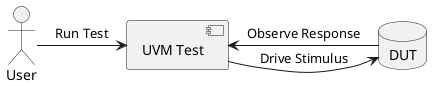
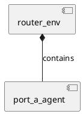
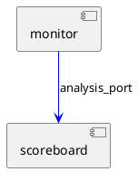
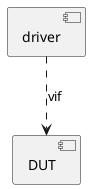
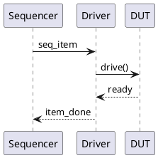

# PlantUML Quick Start Guide

## ✅ Setup Complete!

PlantUML is now installed and ready to use for your UVM Router project.

## 📁 What Was Installed

- **PlantUML JAR**: `/scratch/cs199-buw/UVM_Practice/Router_UVM/docs/diagrams/plantuml.jar`
- **Generator Script**: `/scratch/cs199-buw/UVM_Practice/Router_UVM/docs/diagrams/generate_diagrams.sh`
- **Example Diagram**: `PlantUML_scripts/testbench_architecture.puml` (already generated!)

## 🚀 Usage

### Generate All Diagrams (Easiest)
```bash
make diagrams
```

### Generate from diagrams directory
```bash
cd docs/diagrams
./generate_diagrams.sh
```

### Generate Specific Diagram
```bash
cd docs/diagrams
./generate_diagrams.sh PlantUML_scripts/your_diagram.puml
```

## 📝 Create Your First Diagram

1. Create a new file in `docs/diagrams/PlantUML_scripts/`:
```bash
cd docs/diagrams/PlantUML_scripts
nano my_diagram.puml
```

2. Add PlantUML code:


3. Generate it:
```bash
cd ../..
make diagrams
```

4. View it:
```bash
# PNG will be at: docs/diagrams/PlantUML_scripts/my_diagram.png
```

## 📊 Diagram Examples Already Created

### Testbench Architecture
Location: `PlantUML_scripts/testbench_architecture.puml`

Shows:
- UVM testbench hierarchy
- Agent components
- Scoreboard and predictor
- RAL model
- Analysis port connections
- Virtual interfaces

## 💡 Useful PlantUML Patterns for UVM

### Component Hierarchy


### Analysis Port Connection


### Virtual Interface


### Sequence Flow


## 🎨 Styling Tips

Add to the top of your `.puml` file for better visuals:

```plantuml
@startuml
' Use rectangle style for components
skinparam componentStyle rectangle

' Color scheme
skinparam component {
    BackgroundColor LightBlue
    BorderColor DarkBlue
}

skinparam database {
    BackgroundColor LightYellow
}

' Your diagram here...
@enduml
```

## 📚 Resources

- **Official Docs**: https://plantuml.com/
- **Component Diagrams**: https://plantuml.com/component-diagram
- **Sequence Diagrams**: https://plantuml.com/sequence-diagram
- **Activity Diagrams**: https://plantuml.com/activity-diagram
- **Class Diagrams**: https://plantuml.com/class-diagram

## 🔧 Troubleshooting

### "Java not found"
```bash
java -version
# Should show Java 1.8 or higher
```

### "PlantUML JAR not found"
```bash
ls -lh docs/diagrams/plantuml.jar
# Should show ~21MB file
```

### Diagram not updating?
```bash
# Remove old PNG and regenerate
rm docs/diagrams/PlantUML_scripts/your_diagram.png
make diagrams
```

## ✨ Next Steps

Create diagrams for:
- [ ] Agent internal structure (driver/monitor/sequencer details)
- [ ] Sequence flow diagrams
- [ ] Configuration object propagation
- [ ] DPI-C integration architecture
- [ ] Coverage collection flow
- [ ] Factory override patterns

Happy diagramming! 🎨
