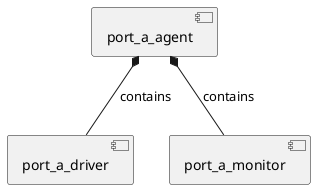

# UVM Router Testbench Diagrams

This directory contains PlantUML diagrams for documenting the UVM testbench architecture.

## Quick Start

### Generate All Diagrams
```bash
cd docs/diagrams
./generate_diagrams.sh
```

### Generate Specific Diagram
```bash
./generate_diagrams.sh PlantUML_scripts/testbench_architecture.puml
```

### From Project Root (using Makefile)
```bash
make diagrams
```

## Available Diagrams

- `testbench_architecture.puml` - Overall UVM testbench structure showing hierarchy and connections

## Creating New Diagrams

1. Create a new `.puml` file in `PlantUML_scripts/` directory
2. Run `./generate_diagrams.sh` to generate PNG output
3. The PNG will be created in the same directory as the `.puml` file

## PlantUML Syntax Quick Reference

### Basic UVM Component


### Analysis Port Connections
```plantuml
Monitor -[#blue]-> Scoreboard : analysis_port
```

### Virtual Interface
```plantuml
Driver ..> DUT : vif (dashed line for interface)
```

## Useful PlantUML Resources

- Official Documentation: https://plantuml.com/
- Component Diagrams: https://plantuml.com/component-diagram
- Sequence Diagrams: https://plantuml.com/sequence-diagram
- Class Diagrams: https://plantuml.com/class-diagram

## Tools

- **PlantUML JAR**: `plantuml.jar` (v1.2024.8)
- **Java Version Required**: 1.8 or higher
- **Helper Script**: `generate_diagrams.sh`

## VS Code / Cursor Integration

For live preview while editing:

1. Install "PlantUML" extension by jebbs
2. Open any `.puml` file
3. Press `Alt+D` (or Cmd+D on Mac) to preview

## Suggested Diagrams to Create

- [ ] Agent internal structure (driver, monitor, sequencer details)
- [ ] Sequence flow diagram
- [ ] Configuration object propagation
- [ ] RAL layer architecture
- [x] DPI-C integration - Shows C++/SystemVerilog integration flow
- [ ] Coverage collection flow
- [ ] Factory override patterns
